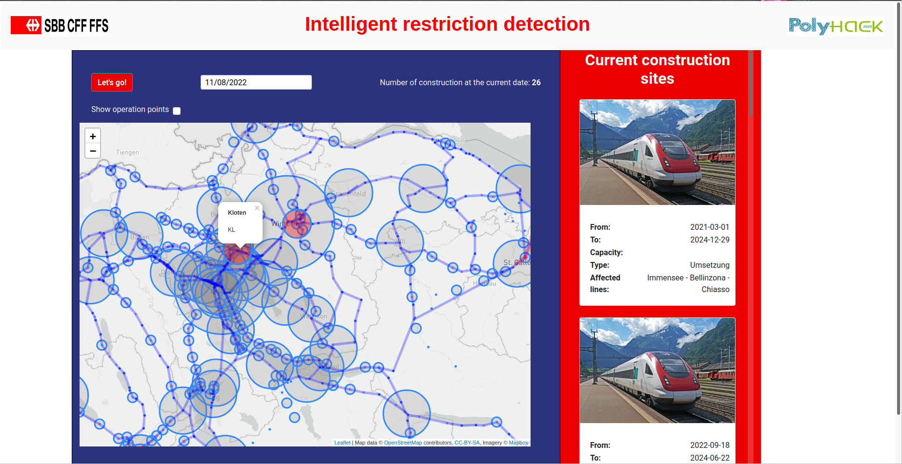

# SBB POLYHACK 2020 Challenge



### Installation
Install all important packages for the `client`:
```shell
cd client
npm init
npm install
```
Install important packages for `server`:
```shell
cd server
pip install requirements.txt
```

### Running the application
To start the application please follow these steps

1. Open the first tab in the root directory and run

```shell 
python server/app.py
```

2. Open the second tab in the root directory and run
```shell
cd SBB_Polyhack/client
npm start
```
